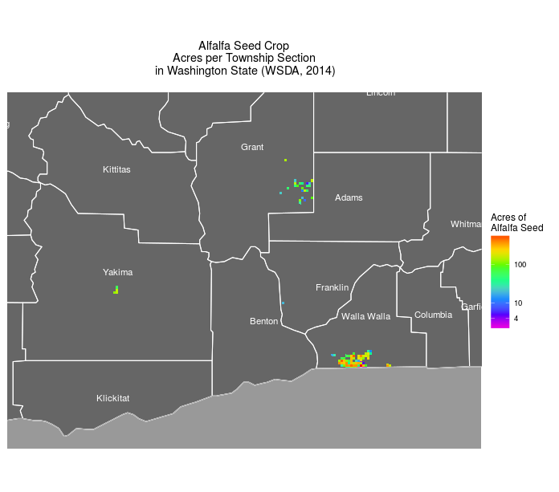

# trsgeocode

Geocode Washington State crop data given a crop type and township
section TRS codes and plot a map showing acres of a crop type per
township section. 

## Copyright and License

Copyright 2016 [Brian High](https://github.com/brianhigh) and Anika Larsen

License: [GNU GPL v3](http://www.gnu.org/licenses/gpl.txt)

## Techniques

This script serves as an example of using the following techniques:

* Querying an ArcGIS REST API using SQL-like syntax
* Using a URL with a "GET" query string to fetch data
* Importing data in JSON format 
* Geocoding TRS codes using the BLM web service API
* Importing data in XML format
* Decoding HTML-encoded text
* Using regular expressions for pattern matching and string replacement
* Calculating a map zoom level from point coordinates
* Mapping with ggplot2
* Caching data in files to avoid redoing slower steps if re-running the script

## Data Sources

Crop information was obtained from: 

* [2014 WSDA Crop Locations, Washington State Department of Agriculture](https://fortress.wa.gov/agr/gis/wsdagis/rest/services/NRAS/2014CropDistribution/MapServer/info/iteminfo)

Geolocation information was obtained from:

* [GeoCommunicator, U.S. Bureau of Land Management (BLM)](http://www.geocommunicator.gov/GeoComm/services.htm#Data)

## Sample Plot

This map was produced by [trsgeocode.R](trsgeocode.R) using "Alfalfa Seed" as
the `cropType`.

